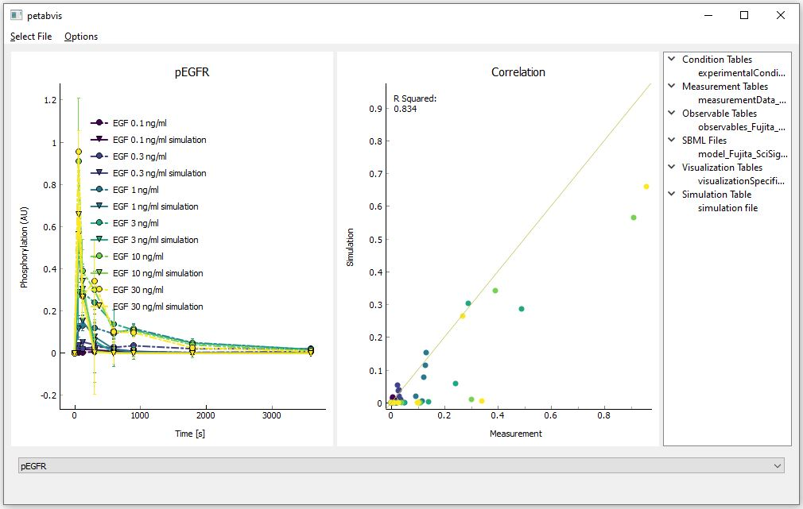

# petabvis

An interactive visualization tool for
[PEtab](https://github.com/PEtab-dev/PEtab) measurement and simulation files.




## Installation

### From PyPI

```shell
pip3 install petabvis
```

### From GitHub

```shell
pip3 install git+https://github.com/PEtab-dev/petabvis.git@main
```

### From a local copy of the source

From within the root source directory, run:

```shell
pip3 install .
```

## Usage

1. Run `petabvis`
2. Select a PEtab YAML file
3. Optionally select a simulation file
4. Navigate through the plots

See also `petabvis -h` for command line usage.
